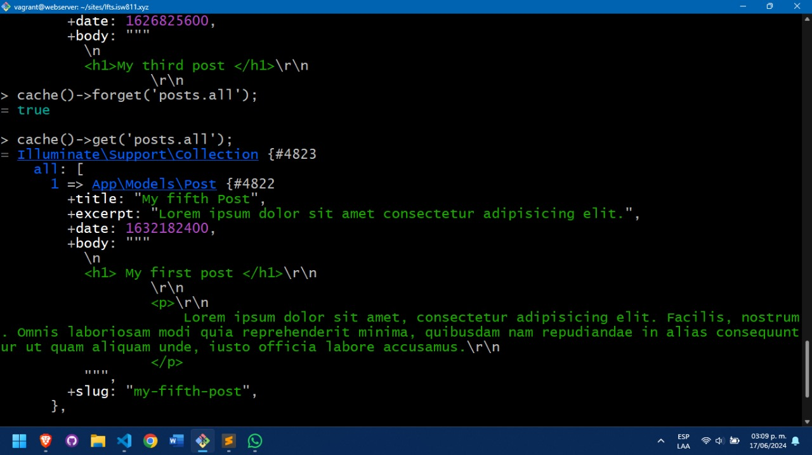

## Episodio 13
- Se ordenan mediante la fecha los posts y se guarda la información de las páginas en cache para siempre.
## Se modifica la función de retorno de la función all en el Post.php
```php
return cache()->rememberForever('posts.all', function(){
            return collect(File::files(resource_path("posts")))
            ->map(fn($file) => YamlFrontMatter::parseFile($file))
            ->map(fn($document) => new Post(
                $document->title,
                $document->excerpt,
                $document->date,
                $document->body(),
                $document->slug
        ))
        ->sortByDesc('date');
        });
```
## Guardando post en caché

