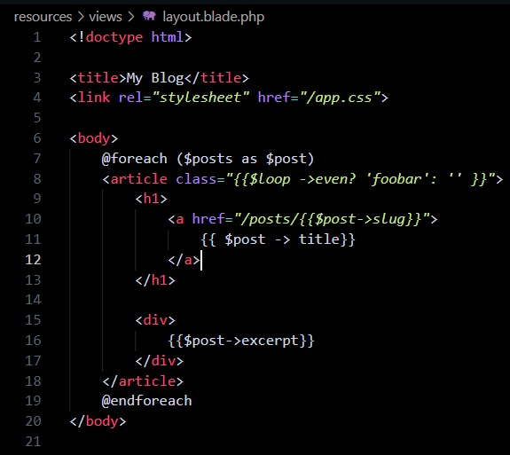
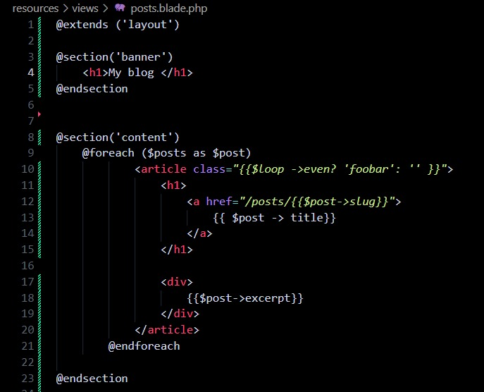

# Episodio 15
## se crea una nueva vista llamada: layout.blade.php y se copia el código de posts.blade.php en él:
```php
<!doctype html>

<title>My Blog</title>
<link rel="stylesheet" href="/app.css">

<body>
    @yield('content')
</body>
----
se agrega la sección de banner en layout.blade:
@extends ('layout')

@section('banner')
    <h1>My blog </h1>
@endsection


@section('content')
    @foreach ($posts as $post)
            <article class="{{$loop ->even? 'foobar': '' }}">
                <h1>
                    <a href="/posts/{{$post->slug}}">
                        {{ $post -> title}}
                    </a>
                </h1>

                <div>
                    {{$post->excerpt}}
                </div>
            </article>
        @endforeach

@endsection
```
## En proceso:


# Primera forma:
## Blade component
```php
<!doctype html>

<title>My Blog</title>
<link rel="stylesheet" href="/app.css">

<body>
    {{ $content }}
</body>
```
# Segunda forma:
## Archivo layout
```php
<!doctype html>

<title>My Blog</title>
<link rel="stylesheet" href="/app.css">

<body>
    {{$slot}}
</body>
```
## Archivo posts.php: 

```php
<x-layout>
    @foreach ($posts as $post)
        <article class="{{ $loop->even ? 'foobar' : '' }}">
            <h1>
                <a href="posts/{{ $post->slug }}">
                    {{ $post->title }}
                </a>
            </h1>

            <div>
                {{ $post->excerpt }}
            </div>
        </article>
    @endforeach
</x-layout>
```

## Y eso en el post.php
```php
<x-layout>
    <article>
        <h1>{{ $post->title }}</h1>

        <div>
            {!! $post->body !!}
        </div>
    </article>

    <a href="/">Go Back</a>
</x-layout>
```





