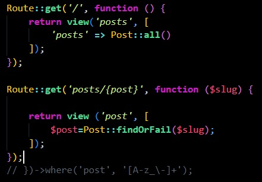

## Episodio 16

- Se agrega validaciones extra a la búsqueda de los posts, tanto en el web.php:

```php
Route::get('/', function () {
    return view('posts', [
        'posts' => Post::all()
    ]);
});

Route::get('posts/{post}', function ($slug) {
    
    return view ('post', [
        $post=Post::findOrFail($slug);
    ]);
});
```

-Y tambien se crea el nuevo método de busqueda en Post.php:
```php
public static function find($slug)
    {
        return static::all()->firstWhere('slug', $slug);
    }

    public static function findOrFail($slug)
    {
        $post= static::find($slug);

        if(! $post){
            throw new ModelNotFoundException();
        }
        return $post;
    }
```
