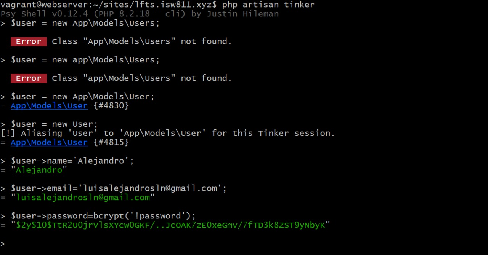

## Episodio 19

-Se ejecuta ```php artisan tinker``` para poder activar la consola conectada a Laravel y poder correr ciertos como mandos , como:
``` bash
user = new App\Models\Users
```

## Buscar un usuario por su id: 
```bash
$user::find(1);
= App\Models\User {#5807
    id: 1,
    name: "Alejandro",
    email: "luisalejandrosln@gmail.com",
    email_verified_at: null,
    #password: "$2y$10$TtR2U0jrVlsXYcw0GKF/..JcOAK7zE0xeGmv/7fTD3k8ZST9yNbyK",
    #remember_token: null,
    created_at: "2024-06-18 02:47:13",
    updated_at: "2024-06-18 02:47:13",}
```
## Para buscarlos a todos:
```bash
 $user::all();
    all: [
      App\Models\User {#4831
        id: 1,
        name: "Alejandro",
        email: "luisalejandrosln@gmail.com",
        email_verified_at: null,
        created_at: "2024-06-18 02:47:13",
        updated_at: "2024-06-18 02:47:13",
      },
      App\Models\User {#4815
        id: 2,
        name: "Sally",
        email: "Sally@gmail.com",
        email_verified_at: null,
        #password: "$2y$10$LveVAI/DwMOn4YnFNUblcez.RwftojYJD6OuzMtMzKbaqqpUaLjeq",
        #remember_token: null,
        created_at: "2024-06-18 02:54:05",
        updated_at: "2024-06-18 02:54:05",
        ]
```
## Buscar solo una propiedad: 
```bash 
 $user->pluck('name');
= Illuminate\Support\Collection {#5656
    all: [
      "Alejandro",
      "Sally",
    ]
```
