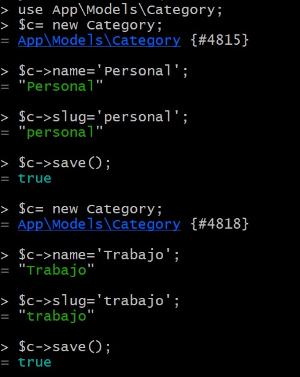

# Episodio 24

## Mediante estos comandos se crea el modelo de las categorias:
```bash
php artisan make:migration create_categories_table
```
## Crear la categoria 
```bash
 php artisan make:model Category -m
```

## Luego se crean las categorías:


## Y luego se crean los posts con la categoria 
```bash 
Post::create(['title' => 'Last post','excerpt' => 'Algunas cosas ahí','body' => 'Lorem ipsum es el texto ','slug'=>'my-last-post','category_id'=>1]);
```

## Luego se crea una funciónq que se llama categoría en Post.php
```php 
public function category()
    {
        return $this->belongsTo(Category::class);
    }
```