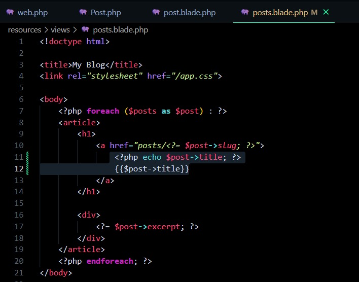

## Episodio 14
- Se modifica el archivo posts.blade.php de esto: ``` php <?= $post->title; ?>``` a esto:```php {{$post->title}}```

- Se modifica el archivo post.blade.php de esto:

```php 
<?= $post->body; ?>
```
a esto: 
```php  
{!!$post->body!!}
```
## Y se encerró el contenido en un Articulo
```php
<article class="{{$loop ->even? 'foobar': '' }}">
```


## Tipo de condicional más elegante: ```@if(true)  @endif```


## Lo que se cambió en el post.blade

