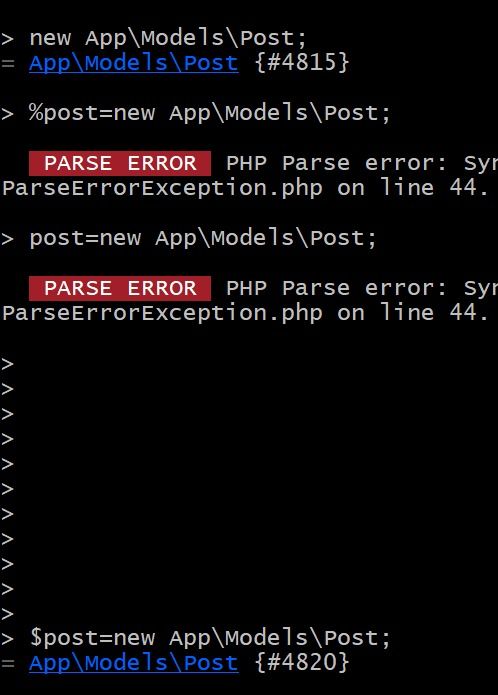

## Episodio 20

## Se crea una nueva migración
``` bash
php artisan make:migration create_posts_table
```

## Se elimina la carpeta de los posts7

## Se agrega la propiedad 2,3,4 y 6:
``` php
 public function up()
    {
        Schema::create('posts', function (Blueprint $table) {
            $table->id();
            $table->string('title');
            $table->text('excerpt');
            $table->text('body');
            $table->timestamps();
            $table->timestamp('published_at')->nullable();
        });
    }
```

## Creación de un modelo: 
```bash
php artisan make:model Post;
```

## Para crear un post, definir sus propiedades y salvarlo:
``` bash
# Aqui se crea el nuevo post 
> $post=new App\Models\Post;
= App\Models\Post {#4813}
# Aqui se definen las propiedades del post 
> $post->title='My First Post';
= "My First Post"

> $post->excerpt='euyyuofoerf2y4o987uhwqef8o794';
= "euyyuofoerf2y4o987uhwqef8o794"

> $post->body='jrfwheiopurhyoiuerhofwiuehrpiuqyehwoiufqhyw3e4uyiorpwhedfuhythyeuwqirfghqiuewrhvflkjdvcnblkasdjhfrgoiuewhrgkjefnwhvhwertoiughqepñirgpoiwerutyopiuwer5tpoiwfñlkjgvweeuyyuofoerf2y4
o987uhwqef8o794';
# Aqui se guardan los cambios del post 
> $post->save();
= true
```
## En web.php se cambió slug por id: 
```php
Route::get('posts/{post}', function ($id) {
    return view ('post', [
        'post' => Post::findOrFail($id)
    ]);
});
```


