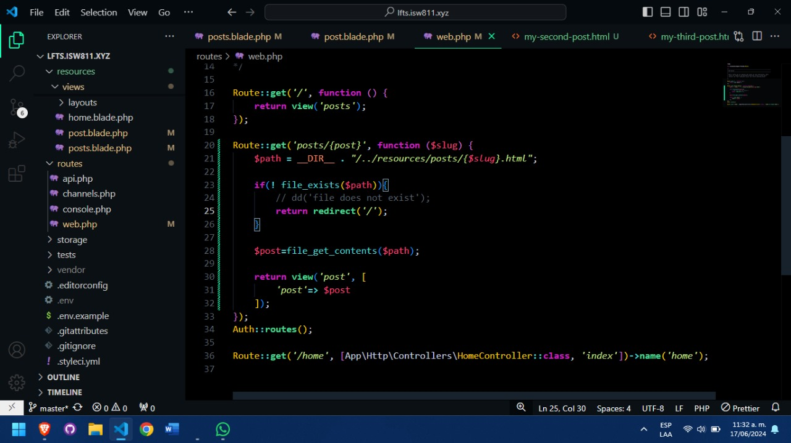

## Episodio 8
- Se crea la lógica para poder enviar el parametro de la ruta de caja uno de las páginas indicviduales de los posts, se crean las tres páginas html y se agrega una pagina de error o de redirección a la página principal.


##  Se añade esto en cada uno de los archivos de los posts
``` html
<h1> <a href="/post">My first post</a> </h1>

<p>Lorem ipsum dolor sit amet, consectetur adipisicing elit. Facilis, nostrum. Omnis laboriosam modi quia reprehenderit minima, quibusdam nam repudiandae in alias consequuntur ut quam aliquam unde, iusto officia labore accusamus.</p>
```

## Luego se modifican y se optimiza al usar variables
```html
 <link rel="stylesheet" href="/app.css">
<body>
    <article>
</article>
    <a href="/">Go Back</a>
</body>

```  

## Y para terminar se agrega la funcion de las rutas en el web.php
``` php
Route::get('posts/{post}', function ($slug) {
    $path = __DIR__ . "/../resources/posts/{$slug}.html";

    if(! file_exists($path)){
        // dd('file does not exist');
        return redirect('/');
    }

    $post=file_get_contents($path);

    return view('post', [
        'post'=> $post
    ]);
});
Auth::routes();
```
