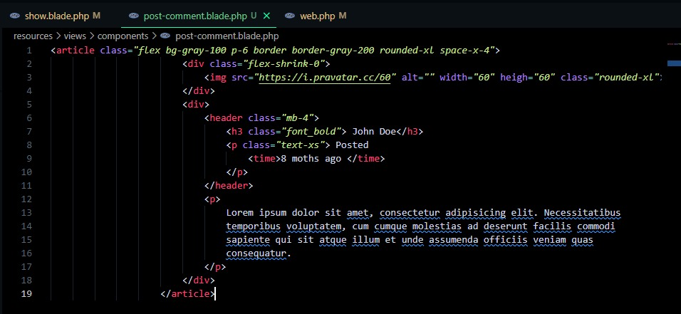

 
# Episodio 52


## Pasemos ahora a los comentarios del post. Empezaremos con el marcado base para un comentario:

## Para eso en el archivo show.blade.php vamos a agregar una nueva sección:
``` php
<article class="flex bg-gray-100 p-6 border border-gray-200 rounded-xl space-x-4">
                        <div class="flex-shrink-0">
                            
                        </div>
                        <div>
                            <header class="mb-4">
                                <h3 class="font_bold"> John Doe</h3>
                                <p class="text-xs"> Posted
                                    <time>8 moths ago </time>
                                </p>
                            </header>
                            <p>
                                Lorem ipsum dolor sit amet, consectetur adipisicing elit. Necessitatibus 
                                temporibus voluptatem, cum cumque molestias ad deserunt facilis commodi 
                                sapiente qui sit atque illum et unde assumenda officiis veniam quas 
                                consequatur.
                            </p>
                        </div>
                    </article>
```
## Posteriormente se crea un nuevo componente .blade.php de nombre post-comment.blade.php en el que se corta la sección creada anteriormente y se pega en nuestro nuevo archivo:



## Y ya creado nuestro componente, lo llamamos en nuestro archivo show.blade.php donde antes habiamos colocado la sección:
``` php
<section class="col-span-8 col-start-5 mt-10 space-y-6">
    <x-post-comment/>
    <x-post-comment/>
    <x-post-comment/>
    <x-post-comment/>
</section> 
``` 
- [Menú de episodios](../Admin.md)
- [Episodio 53](../Episodio54/Episodio%2054.md)