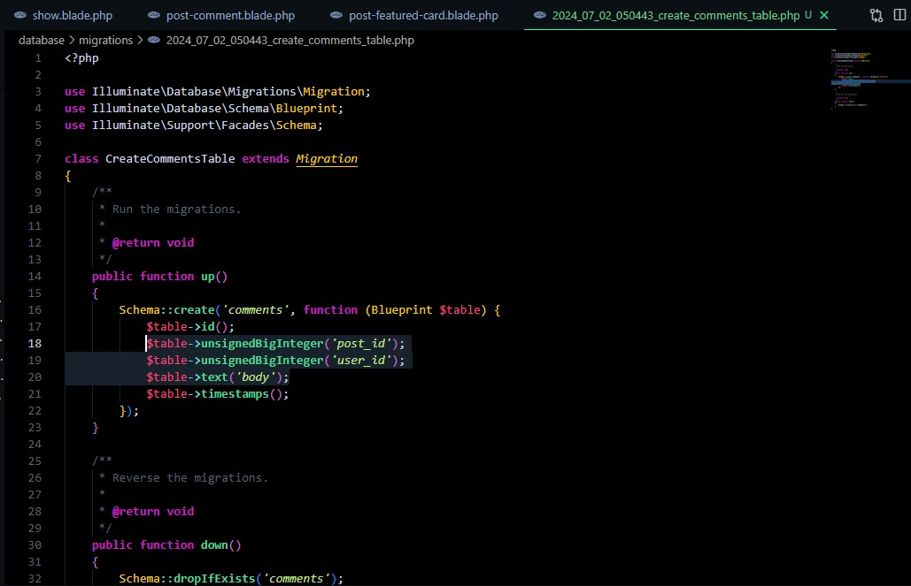
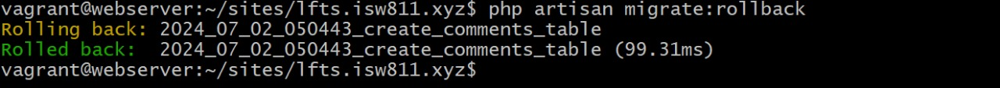

# Episodio 53

## A continuación podemos pasar a crear la migración y la tabla correspondiente para nuestros comentarios. Esto nos dará la oportunidad de discutir más profundamente las limitaciones clave externas.

## Inicialmente en nuestra maquina virtau vamos a ejecutar:
```bash
php artisan make:model Comment -mfc
```

## Para poder crear un modelo llamado comment en app/Models


## Y luego en nuestro modelo de comentarios creado, agregamos las propiedades  marcadas en la imagen:

``` php
Schema::create('comments', function (Blueprint $table) {
            $table->id();
            $table->unsignedBigInteger('post_id');
            $table->unsignedBigInteger('user_id');
            $table->text('body');
            $table->timestamps();
        });
```




## Luego ejecutamos php artisan migrate para actualizar los cambios generados

## Y luego insertamos esta linea de código:
``` php
$table->foreign('post_id')->references('id')->on('posts')->cascadeOnDelete();
``` 
## Con el fin de establecer una relación de clave foránea entre la columna post_id de la tabla actual y la columna id de la tabla posts.

## Y con el objetivo de anular los cambios anteriores y actualizarlos con nuestra nueva relación, se ejecuta un rollback:
``` bash
php artisan migrate:rollback
``` 


## Luego de esto actualizamos con:
```bash  
php artisan migrate 
```


## Luego volvemos a modificar el modelo y creamos una nueva propiedad: 
``` php
$table->foreignId('post_id')->constrained()->cascadeOnDelete();
``` 
## Y eliminamos estas: 

``` php
$table->unsignedBigInteger('post_id');
$table->foreign('post_id')->references('id')->on('posts')->cascadeOnDelete();
``` 

## Y para terminar después de todos los demás cambios, así es como nos queda el archivo:
``` php
Schema::create('comments', function (Blueprint $table) {
            $table->id();
            $table->foreignId('post_id')->constrained()->cascadeOnDelete();
            $table->foreignId('user_id')->constrained()->cascadeOnDelete();
            $table->text('body');
            $table->timestamps(); 
        });
``` 
## Luego damos ```php artisan migrate:rollback ``` de nuevo y luego ```php artisan migrate``` para actualizar los cambios.

## Luego vamos al archivo create_posts_table.php y agregamos la sentencia de la yave foranea:
``` php
$table->foreignId('user_id')->constrained()->cascadeOnDelete();
``` 
- [Menú de episodios](../Admin.md)
- [Episodio 54](../Episodio54/Episodio%2054.md)