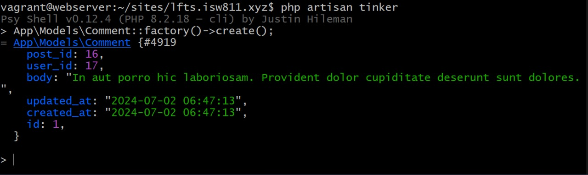
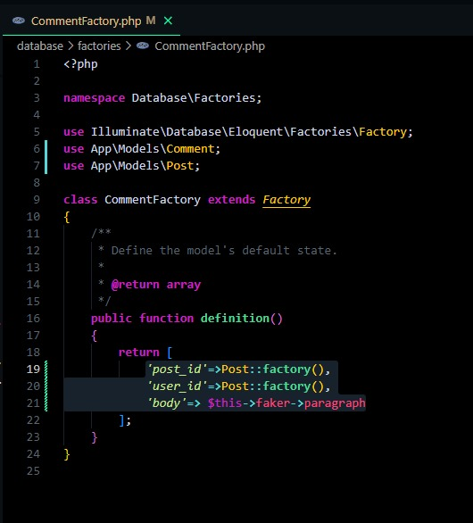

# Episodio 54
## Ahora que tenemos una tabla de comentarios lista, cambiemos y construyamos los atributos necesarios para nuestra CommentFactory. Una vez completado, volveremos a nuestra página de publicación y haremos que la sección de comentarios recorra lo que hemos almacenado en la base de datos.

## Agregamos estas propiedades en nuestro CommentFactory:
```php
return [
            'post_id'=>Post::factory(),
            'user_id'=>Post::factory(),
            'body'=> $this->faker->paragraph()
        ];
```
Imagen---

## Además agregamos los parentesis a las propiedades de word y slug en el CategoryFactory:
```php
'name'=>$this->faker->word(),
'slug'=>$this->faker->slug()
```

## Además, vamos a el PostFactory y realizamos la misma acción con sentence y slug:
```php
return [
            'user_id'=>User::factory(),
            'category_id'=>Category::factory(),
            'title'=>$this->faker->sentence(),
            'slug'=>$this->faker->slug(),
            'excerpt' => '<p>' . implode('</p><p>', $this->faker->paragraphs(2)) . '</p>',
            'body' => '<p>' . implode('</p><p>', $this->faker->paragraphs(6)) . '</p>'
        ];
```
## Al igual que en el UserFactory con la propiedad userName:
```php
return [
            'name' => $this->faker->name(),
            'username' => $this->faker->unique()->userName(),
            'email' => $this->faker->unique()->safeEmail(),
            'email_verified_at' => now(),
            'password' => '$2y$10$92IXUNpkjO0rOQ5byMi.Ye4oKoEa3Ro9llC/.og/at2.uheWG/igi', // password
            'remember_token' => Str::random(10),
        ];
```
## Luego se habre la terminal de tinker con 
```bash
php artisan tinker 
```

## Para luego utilizar el factory y crear nuevos comentarios automáticos:



## Luego para crear las relaciones con los posts y demás:

## Agregamos esta función en el modelos Post:

```php
public function comments()
    {
        return $this->belongsTo(User::class,'user_id');
    }
```
## Luego vamos al modelo Comment y creamos estas dos nuevas funciones:
```php
public function post(){ //post_id
        return $this->belongsTo(Post::class);
    } 

    public function author(){//author_id
        return $this->belongsTo(User::class, 'user_id');
    }
```
## Editamos el archivo show.blade.php con el fin de reenderizar los comentarios que ya fueron creados en la base de datos:
## Quitamos los componentes <x-post-comment/>, y los sustituimos con esto:
```php
 @foreach($post->$comments as $comment) 
                   <x-post-comment :comment="$comment"/>
                   @endforeach
```
## Luego vamos a post-comment.blade.php:
## Importamos las props:
```php
@props(['comment']) 
```
## y luego las usamos aquí:
```php
<header class="mb-4">
    <h3 class="font_bold"> {{$comment->author->username}}</h3>
    <p class="text-xs"> Posted
    <time>{{$comment->created_at}} </time>
    </p>
</header>
<p>{{$comment->body}}</p>
```

## Posterior a eso, creamos comentarios desde la base de datos, comentarios de prueba y luego entramos a tinker para crearlos automáticamente con: 
```bash
App\Models\Comment::factory(10)->create(['post_id'=>1]);
```

## Para mejorar la estética, se agrega esta variable a este link: ?id={{$comment->id}}
```php
id}}" alt="" width="60" heigh="60" class="rounded-xl">
```
- [Menú de episodios](../Admin.md)
- [Episodio 55](../Episodio55/Episodio%2055.md) 
