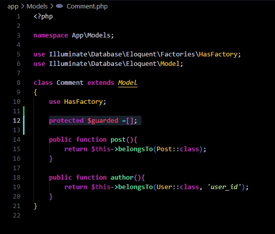

# Episodio 56 

## Ahora que el formulario de comentarios está completamente diseñado, podemos agregar la lógica necesaria para "activarlo".

## Agregamos una ruta en el web.php:
``` php
Route::post('posts/{post:slug}/comments', [PostCommentsController::class, 'store']);
```
## Cambiamos la acción del formulario en el show.blade.php:
``` php
<form method="POST" action="/posts/{{$post->slug}}/comments">
``` 
## Y agregamos esta línea en el modelo del comentario Comment:
``` php
protected $guarded =[]; 
``` 
## Para luego buscamos en los modelos las lineas en las que salga esto :protected $guarded =[]; y los eliminamos


## En el componente post.comment.blade.php agregamos la instrucción de diferencia con el tiempo actual:
``` php
<time>{{$comment->created_at->format('F j, Y, g_i a')}} </time>
``` 
## Agregamos la sentencia de @auth en el componente del formulario(con esto logramos que si no hay un usuario conectado no se muestre el formulario de los comentarios):
``` php
<x-panel>
    <form method="POST" action="/posts/{{$post->slug}}/comments">
        @csrf
        <header class='flex items-center'>
            id()}}" alt="" width="40" height="40" class="rounded-full">
            <h2 class='ml-4'>Want to participate?</h2>
        </header>
        <div class='mt-10'>
            <textarea name="body" class='w-full text-sm focus:outline-none focus:ring' rows='5' placeholder="Do you want to say anything?"></textarea>
        </div>
        <div class='flex justify-end mt-6 border-t border-gray-200 pt-6'>
            <button type='submit' class='bg-blue-500 text-white uppercase font-semibold text-xs py-2 px-10 rounded-2xl hover:bg-blue-600'>
                Post
            </button>
        </div>
    </form>
</x-panel>
@else
    <p class='font-semibold'>
        <a href="/register" class='hover:underline'>Register</a> or
        <a href="/login" class='hover:underline'>Log in</a>
        to leave a comment
    </p>
@endauth

``` 

- [Menú de episodios](../Admin.md)
- [Episodio 57](../Episodio57/Episodio%2057.md) 

