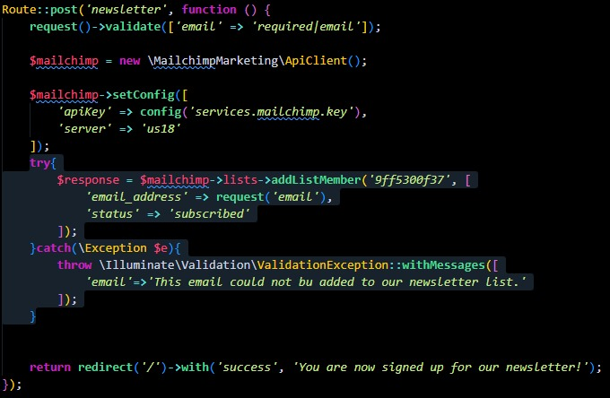

# Episodio 59
## Bien, ahora que entendemos los conceptos básicos de cómo agregar una dirección de correo electrónico a una lista de Mailchimp, actualicemos el formulario del boletín.

## Modificamos un poco la ruta de newsletter:
```php
Route::post('newsletter', function(){
    request()->validate(['email'=>'required|email'])
    $mailchimp = new \MailchimpMarketing\ApiClient();
    
    $mailchimp->setConfig([
    	'apiKey' => config('services.mailchimp.key'),
    	'server' => 'us18'
    ]);
    
    $response = $mailchimp->lists->addListMember('9ff5300f37',[
        'email_address'=> 'email',
        'status'=> 'subscribed'
    ]);
    return redirct('/')->with('success','You are now signed up for our newsletter!')
});
```

## Además vamos al componente layout.blade.php y agregamos los campos del nombre en el input con el nombre de email y en el form la acción de newsletter:
```php
<form method="POST" action="/newsletter" class="lg:flex text-sm">
    @csrf
    <div class="lg:py-3 lg:px-5 flex items-center">
        <label for="email" class="hidden lg:inline-block">
            
        </label>

        <input id="email" name="email" type="text" placeholder="Your email address"
               class="lg:bg-transparent py-2 lg:py-0 pl-4 focus-within:outline-none">
    </div>
</form>

```
## Añadimos la validación de los correos, y las acciones al encontrar uno en la ruta newsletter:
```php
Route::post('newsletter', function () {
    request()->validate(['email' => 'required|email']);
    
    $mailchimp = new \MailchimpMarketing\ApiClient();
    
    $mailchimp->setConfig([
        'apiKey' => config('services.mailchimp.key'),
        'server' => 'us18'
    ]);
    try{
        $response = $mailchimp->lists->addListMember('9ff5300f37', [
            'email_address' => request('email'),
            'status' => 'subscribed'
        ]);
    }catch(\Exception $e){
        throw \Illuminate\Validation\ValidationException::withMessages([
            'email'=>'This email could not bu added to our newsletter list.'
        ]);
    }
    
    
    return redirect('/')->with('success', 'You are now signed up for our newsletter!');
});
```
## Y se agrega un aviso de usuario agregado correctamente en el layout.blade.php:
```php
<div>
    <input id="email" name="email" type="text" placeholder="Your email address"
           class="lg:bg-transparent py-2 lg:py-0 pl-4 focus-within:outline-none">

    @error('email')
        <span class='text-xs text-red-500'>{{$message}}</span>
    @enderror
</div>

```


- [Menú de episodios](../Admin.md)
- [Episodio 60](../Episodio60/Episodio%2060.md) 