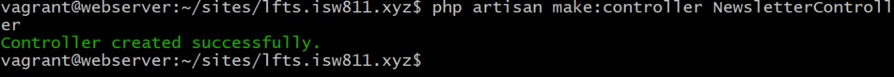

# Episodio 60
## Creo que nos sentimos lo suficientemente cómodos con este pequeño fragmento de código como para extraerlo en su propia clase de servicio Newsletter. Por lo que en este episodio vamos a hacerlo.

## Para ello vamos a services.php y modoficamos un poco la ultima propiedad:
```php
 'mailchimp' => [
        'key' => env('MAILCHIMP_KEY'),
        'lists' => [
            'subscribers' => env('MAILCHIMP_LIST_SUBSCRIBERS')
        ]
    ]
```
## en el archivo .env se agregan una nueva variable para mayor seguridad: 
```txt
MAILCHIMP_LIST_SUBSCRIBERS=9ff5300f79
```
## En el archivo web.php limpiamos la ruta, quitando toda la lógica(que pasará a estar en un controlador aparte):
```php
Route::post('newsletter', NewsletterController::class);
```
## Además es de considerar que creamos una nueva carpeta llamada Services en app y que en esta creamos un archivo llamado Newsletter con este contenido:
```php
public function subscribe(string $email, string $list = null)
    {
        $list ??= config('services.mailchimp.lists.subscribers');

        return $this->client()->lists->addListMember($list, [
            'email_address' => $email,
            'status' => 'subscribed'
        ]);
    }

    protected function client()
    {
        return (new ApiClient())->setConfig([
            'apiKey' => config('services.mailchimp.key'),
            'server' => 'us18'
        ]);
    }
```
## Creamos un controlador para Newsletter:
```bash
php artisan make:controller NewsletterController:
```
## Ejemplo:

## Y le agregamos las funcionalidades:
``` php
public function __invoke(Newsletter $newsletter)
    {
        request()->validate(['email' => 'required|email']);

        try {
            $newsletter->subscribe(request('email'));
        } catch (Exception $e) {
            throw ValidationException::withMessages([
                'email' => 'This email could not be added to our newsletter list.'
            ]);
        }

        return redirect('/')
            ->with('success', 'You are now signed up for our newsletter!');
    }
```
- [Menú de episodios](../Admin.md)
- [Episodio 61](../Episodio61/Episodio%2061.md)