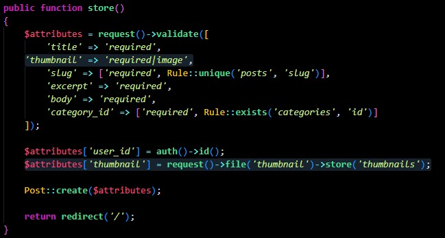

# Episodio 64
## En este video, aprenderá cómo cargar imágenes en su disco local usando una entrada de archivo estándar y la clase UploadedFile de Laravel. Con el fin de poder incluir imagenes en los posts

## Para esto modificamos un poco el formulario para que se agregue e campo de entrada de la imagen:
```php
<x-layout>
    <section class="py-8 max-w-md mx-auto">
        <h1 class="text-lg font-bold mb-4">
            Publish New Post
        </h1>

        <x-panel>
            <form method="POST" action="/admin/posts" enctype="multipart/form-data">
                @csrf

                <div class="mb-6">
                    <label class="block mb-2 uppercase font-bold text-xs text-gray-700"
                           for="title"
                    >
                        Title
                    </label>

                    <input class="border border-gray-400 p-2 w-full"
                           type="text"
                           name="title"
                           id="title"
                           value="{{ old('title') }}"
                           required
                    >

                    @error('title')
                        <p class="text-red-500 text-xs mt-2">{{ $message }}</p>
                    @enderror
                </div>

                <div class="mb-6">
                    <label class="block mb-2 uppercase font-bold text-xs text-gray-700"
                           for="slug"
                    >
                        Slug
                    </label>

                    <input class="border border-gray-400 p-2 w-full"
                           type="text"
                           name="slug"
                           id="slug"
                           value="{{ old('slug') }}"
                           required
                    >

                    @error('slug')
                        <p class="text-red-500 text-xs mt-2">{{ $message }}</p>
                    @enderror
                </div>

                <div class="mb-6">
                    <label class="block mb-2 uppercase font-bold text-xs text-gray-700"
                           for="thumbnail"
                    >
                        Thumbnail
                    </label>

                    <input class="border border-gray-400 p-2 w-full"
                           type="file"
                           name="thumbnail"
                           id="thumbnail"
                           required
                    >

                    @error('thumbnail')
                        <p class="text-red-500 text-xs mt-2">{{ $message }}</p>
                    @enderror
                </div>


                <div class="mb-6">
                    <label class="block mb-2 uppercase font-bold text-xs text-gray-700"
                           for="excerpt"
                    >
                        Excerpt
                    </label>

                    <textarea class="border border-gray-400 p-2 w-full"
                           name="excerpt"
                           id="excerpt"
                           required
                    >{{ old('excerpt') }}</textarea>

                    @error('excerpt')
                        <p class="text-red-500 text-xs mt-2">{{ $message }}</p>
                    @enderror
                </div>

                <div class="mb-6">
                    <label class="block mb-2 uppercase font-bold text-xs text-gray-700"
                           for="body"
                    >
                        Body
                    </label>

                    <textarea class="border border-gray-400 p-2 w-full"
                           name="body"
                           id="body"
                           required
                    >{{ old('body') }}</textarea>

                    @error('body')
                        <p class="text-red-500 text-xs mt-2">{{ $message }}</p>
                    @enderror
                </div>

                <div class="mb-6">
                    <label class="block mb-2 uppercase font-bold text-xs text-gray-700"
                           for="category_id"
                    >
                        Category
                    </label>

                    <select name="category_id" id="category_id">
                        @foreach (\App\Models\Category::all() as $category)
                            <option
                                value="{{ $category->id }}"
                                {{ old('category_id') == $category->id ? 'selected' : '' }}
                            >{{ ucwords($category->name) }}</option>
                        @endforeach
                    </select>

                    @error('category')
                        <p class="text-red-500 text-xs mt-2">{{ $message }}</p>
                    @enderror
                </div>

                <x-submit-button>Publish</x-submit-button>
            </form>
        </x-panel>
    </section>
</x-layout>
```
## Además, en el PostController.php se agrega el dato de entra de tipo imagen y el atributo de la imagen:
```php
public function store()
    {
        $attributes = request()->validate([
            'title' => 'required',
            'thumbnail' => 'required|image',
            'slug' => ['required', Rule::unique('posts', 'slug')],
            'excerpt' => 'required',
            'body' => 'required',
            'category_id' => ['required', Rule::exists('categories', 'id')]
        ]);

        $attributes['user_id'] = auth()->id();
        $attributes['thumbnail'] = request()->file('thumbnail')->store('thumbnails');

        Post::create($attributes);

        return redirect('/');
    }
```


## Cambiamos esta linea : 
```php
'default' => env('FILESYSTEM_DRIVER', 'local')
```
### por esta otra:
```php
'default' => env('FILESYSTEM_DRIVER', 'public')
```
### En el archivo config\filesystems.php 
### 

## Y cambiamos esta etiqueta:
```php
 
```
## por esta otra 
```php
thumbnail) }}" alt="Blog Post illustration" class="rounded-xl"> 
``` 
## en el archivo resources\views\components\post-card.blade.php

## Al igual, se cambia la etiqueta: 
```php
 
```
### por esta otra:
```php
thumbnail) }}" alt="Blog Post illustration" class="rounded-xl"> 
```
### en el archivo resources\views\components\post-featured-card.blade.php

## Y tambien esta: 
```php

``` 
### por esta: 
```php
thumbnail) }}" alt="" class="rounded-xl"> 
```
### en el archivo resources/views/posts/show.blade.php 

## Agregamos la propiedad 
```php 
$table->string('thumbnail')->nullable();
``` 
## en el archivo database\migrations\2024_06_18_030428_create_posts_table.php

## Y luego de ese cambio poblamos nuevamente nuestra base de datos con el comando
```php
php artisan fresh: --seed  
```
- [Menú de episodios](../Admin.md)
- [Episodio 65](../Episodio65/Episodio%2065.md)